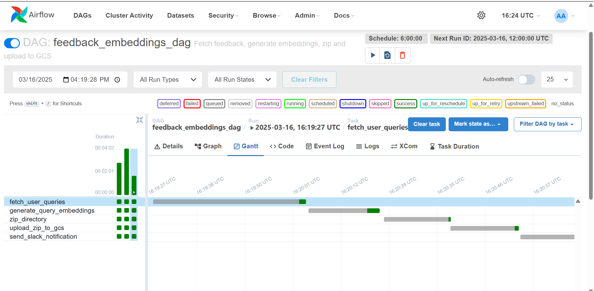

# Overview

This project aims to develop an LLM-powered chatbot to generate SQL queries based on user input questions. The system will be built using Google Cloud Platform (GCP) and will incorporate MLOps best practices, including monitoring and CI/CD pipelines, to ensure robust and efficient operation.

This repository hosts the data pipeline designed to process data in BigQuery. The pipeline is responsible for creating and managing a retail dataset, which includes the following tables:
- **Customers**
- **OrderItems**
- **Orders**
- **ProductReviews**
- **Products**

# Data Pipeline - Key Components and Workflow

The data pipeline is implemented using Apache Airflow to orchestrate tasks that extract, transform, and load (ETL) data into BigQuery. It includes several DAGs (Directed Acyclic Graphs) to automate schema extraction, feedback processing, and embedding generation for enhanced query interpretation.
## Data Acquistion 
The SQL chatbot operates on data stored in BigQuery, where users execute queries to retrieve relevant information. Unlike RAG-based systems, our chatbot directly translates natural language queries into SQL without requiring external document retrieval. Since our use case does not involve data ingestion or ETL processes, our data pipeline focuses on three key workflows:
1. **Schema Extraction**:
   - Extracts metadata (table names, column names, data types, etc.) from BigQuery.
   - Ensures that the chatbot understands the database structure to generate accurate SQL queries.
2. **Schema Embeddings Generation**:
   - Converts extracted schema information into vector embeddings.
   - Enhances query generation by allowing semantic understanding of database structure.
3. **Feedback Processing**:
   - Collects user feedback on query results
   - Adjusts future query generation by leveraging historical feedback for continuous improvement.
   - Stores feedback data using ChromaDB for retrieval during query refinement.

Since the pipeline does not involve direct data acquisition from APIs or external sources, our focus is on schema understanding, embeddings, and iterative feedback integration to enhance SQL generation accuracy.

## Key Components:
1. **Schema Extraction DAG (`extract_bigquery_schema`)**
   - Extracts table schemas from BigQuery.
   - Saves schema files to Google Cloud Storage (GCS) for further processing.
   - Validates the schema extraction process.
   - Sends notifications via Slack upon successful execution.
   

2. **Feedback Embeddings DAG (`feedback_embeddings_dag`)**
   - Extracts user feedback data from BigQuery.
   - Generates embeddings for feedback questions using `sentence-transformers`.
   - Stores processed data and embeddings in GCS for downstream use.
   - Archives and uploads a ChromaDB store of embeddings.
   - Sends notifications via Slack upon successful execution.
   

3. **Schema Embeddings DAG (`schema_embeddings_dag`)**
   - Creates embeddings for schema metadata using Vertex AI’s `textembedding-gecko@003` model.
   - Stores embeddings in a ChromaDB instance.
   - Saves the ChromaDB instance to GCS for efficient retrieval.
   - Sends notifications via Slack upon successful execution.
   

## Workflow:
1. **Schema Extraction:** The `extract_bigquery_schema` DAG retrieves table schemas from BigQuery, processes them for natural language prompts, and stores them in GCS.
2. **Feedback Processing:** The `feedback_embeddings_dag` extracts user feedback, converts it into embeddings, and archives the embeddings for retrieval.
3. **Schema Embeddings:** The `schema_embeddings_dag` generates embeddings for table schemas to facilitate SQL query generation.
4. **Notifications:** Each DAG includes a Slack notification task to inform users of the pipeline’s execution status.

This modular approach ensures a scalable and efficient pipeline, supporting AI-driven SQL generation and query interpretation.

# Data and Schema Drift Monitoring

The data pipeline includes automated monitoring for schema drift and data drift through the `monitor_drift` DAG. This DAG runs daily checks to ensure data quality and detect anomalies in the retail dataset.

## Monitoring Components

### 1. Schema Drift Detection
- Continuously monitors changes in BigQuery table schemas
- Compares current schema with previously stored schema in GCS
- Detects changes in:
  - Column additions or removals
  - Data type modifications
  - Column name changes
- Alerts via Slack when schema changes are detected

### 2. Data Drift Detection
- Monitors statistical properties of the data:
  - Mean and standard deviation of numeric columns
  - Null value percentages
  - Distribution shifts
- Samples 1000 records for statistical analysis
- Compares current statistics with historical baseline
- Triggers alerts when significant deviations (>10%) are detected

## DAG Structure and Workflow
The `monitor_drift` DAG consists of three main tasks:
1. `check_schema_drift`: Validates schema consistency
2. `check_data_drift`: Analyzes statistical properties
3. `send_slack_alert`: Notifies team of detected issues

### DAG Visualization


### Task Timeline


## Alert Mechanisms
- **Slack Integration**: Real-time notifications for:
  - Schema changes
  - Statistical anomalies
- **Alert Levels**:
  - Warning: Minor deviations detected
  - Critical: Significant changes requiring immediate attention

## Implementation Details
The monitoring system is implemented in `DataPipeline/dags/schema_data_drift.py` with the following key features:

1. **Schema Validation**
   - Automated schema extraction from BigQuery
   - Schema comparison with baseline
   - Version control for schema changes

2. **Statistical Monitoring**
   - Automated statistics generation using sampling (1000 records)
   - Distribution analysis through mean and standard deviation
   - Missing value tracking through null percentage analysis
   - Drift detection with 10% threshold for statistical changes

## Benefits
- Early detection of data quality issues
- Automated monitoring reduces manual oversight
- Comprehensive documentation of data changes
- Improved data reliability through continuous monitoring

This monitoring system ensures the reliability of our retail dataset by detecting schema and statistical drift, supporting accurate SQL query generation and maintaining high data quality standards.

Note: For bias detection capabilities, please refer to the `PromptValidation/bias_check.py` implementation, which handles bias detection in query generation.

# Instructions to Reproduce

To reproduce this data pipeline on Google Cloud Platform (GCP), follow these instructions:

## Prerequisites
- **Google Cloud Account:** Make sure you have an active Google Cloud account.
- **Project Setup:** Create a new GCP project or use an existing one. Note down the `PROJECT_ID`.
- **Billing Enabled:** Ensure billing is enabled for your project.
- **Google Cloud SDK:** Install the Google Cloud SDK to interact with GCP resources.
- **Python 3.x:** Ensure Python 3.10 or later is installed.

## Step 1: Set Up GCP Services and Resources
### 1.1 Enable Required APIs
Go to GCP Console and enable the following APIs:
- BigQuery
- Cloud Composer
- VertexAI

### 1.2 Set up BigQuery Datasets
Create the necessary datasets in BigQuery:
```sh
DATASET_ID="RetailDataset"
BQ_DATASET="Feedback_Dataset"
```

### 1.3 Set Up Cloud Storage Buckets
Create the required Cloud Storage buckets:
```sh
BUCKET_NAME="bigquery-schema-store"
GCS_BUCKET="feedback-questions-embeddings-store"
BUCKET_NAME="bigquery-embeddings-store"
```

Create a Cloud Storage bucket to store data and pipeline artifacts:
```sh
export BUCKET_NAME=<your-bucket-name>
gcloud storage buckets create gs://$BUCKET_NAME --project $PROJECT_ID --location=<region>
```
Ensure the region aligns with your Composer environment or use a multi-region bucket.

Create directories within the bucket:
```sh
gsutil mkdir gs://$BUCKET_NAME/data
```

## Step 2: Configure Airflow with Cloud Composer
### 2.1 Create a Cloud Composer Environment
- Go to the Cloud Composer page in the GCP Console.
- Create a new Composer environment, select Python 3 as the runtime, and use the same region as the other resources.
- Note the Composer Environment Name and GCS Bucket associated with Composer.

### 2.2 Upload DAGs and Scripts
- Update the GitHub workflows to match your GCP environment (Project, Bucket, etc.).
- The workflow will handle uploading the files to GCS automatically.

### 2.3 Install Python Dependencies
- Update the `requirements.txt` file with the necessary dependencies.
- Install the dependencies in Composer by specifying the path to `requirements.txt` in the Composer environment configuration.

## Step 3: CI/CD Pipeline Setup with GitHub Actions
### 3.1 GitHub Actions Workflow
The `airflow-ci.yml` workflow will:
- Run tests
- Upload DAGs and scripts to GCS only after test runs pass

## Step 4: Testing the Pipeline
### 4.1 Trigger the Pipeline
- Trigger the DAGs via the Composer UI or let them run as per the defined schedule.

### 4.2 Verify Data in Buckets
- After successful DAG runs, check your buckets for generated embeddings and schema data to confirm processing.

### 4.3 Logs and Debugging
- Monitor logs from Airflow in the Composer environment for debugging. Logs are available for each task within the DAG.

### 4.4 Alerts and Notifications
- Configure Slack notifications in Composer:
  - Set the **Connection ID**: `slack_webhook`
  - **Connection Type**: `HTTP`
  - **Host**: `https://hooks.slack.com/services/`
  - **Password**: Full Slack webhook URL

## Alternative: Running Locally
To run the Airflow pipeline locally using Docker, follow these steps:
```sh
docker compose build
docker compose up airflow-init
docker compose up
```

Following these steps will ensure a smooth deployment of the data pipeline on GCP and local environment.

# Test Module

## Overview
This repository contains a pipeline with several components, including feedback extraction, data embedding generation, and data upload. To ensure the robustness of each component, unit tests have been written to validate the functionality and reliability of the pipeline.

The tests focus on the following areas:

- **Data Preprocessing**: Validates the correct processing of raw data into a usable format.
- **Data Transformation**: Ensures proper transformations are applied to data, such as generating embeddings.
- **Data Upload**: Confirms that data is successfully archived and uploaded to storage services.

Unit tests are written using `pytest` and `unittest` to ensure that the pipeline can handle edge cases, missing values, and anomalies.

## Testing Frameworks
We use the following testing frameworks:
- `pytest`: For writing and running the tests.
- `unittest`: For testing specific components like schema extraction and GCS uploading.

## Workflow Structure
The CI/CD pipeline is triggered by any push to the `main` branch or by a pull request targeting the `main` branch. The workflow consists of the following stages:

- **Test Stage**: Run unit tests using `pytest` and `unittest`, ensuring all components are functioning as expected.
- **Deploy Stage**: If tests pass successfully, the DAGs and associated scripts are deployed to Cloud Composer.

# Tracking and Logging

## Purpose:
Tracking and logging are essential for monitoring the data pipeline’s execution and detecting issues at each stage.

## In the Context of Our SQL Chatbot:
- **Tracking**: The execution flow of the pipeline (e.g., schema extraction, embedding generation, feedback processing) is tracked through **Airflow**. This helps to ensure that tasks are executed in the correct order and that issues are identified promptly.
  
- **Logging**: Monitor logs from Airflow in the Composer environment for debugging. Logs are available for each task within the DAG.

# Pipeline Flow Optimization

## Purpose:
To optimize the pipeline for performance and efficiency, ensuring that tasks are executed in the most efficient manner possible.

## In the Context of Our SQL Chatbot:
- *Airflow Gantt Chart:* *Airflow* provides a visual representation of task durations and dependencies in the form of a Gantt chart. This helps us identify tasks that are taking too long and investigate potential bottlenecks in the pipeline.




